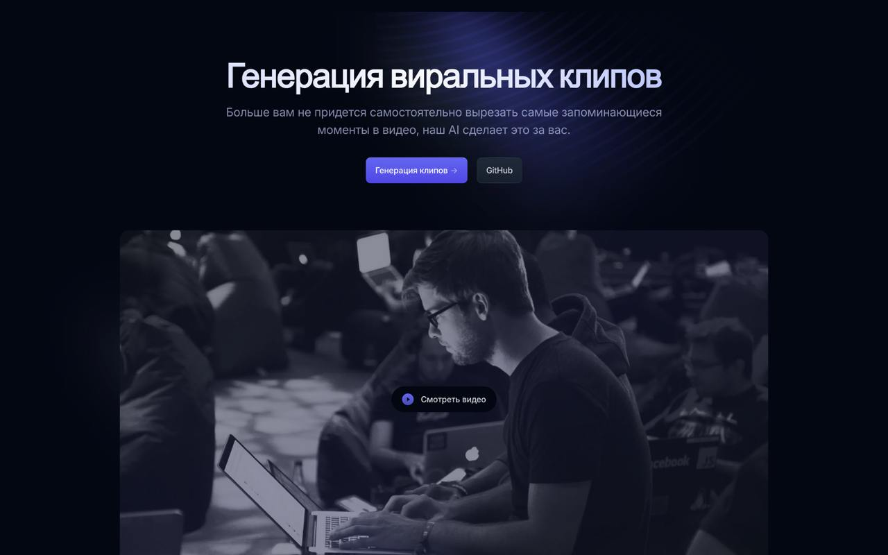
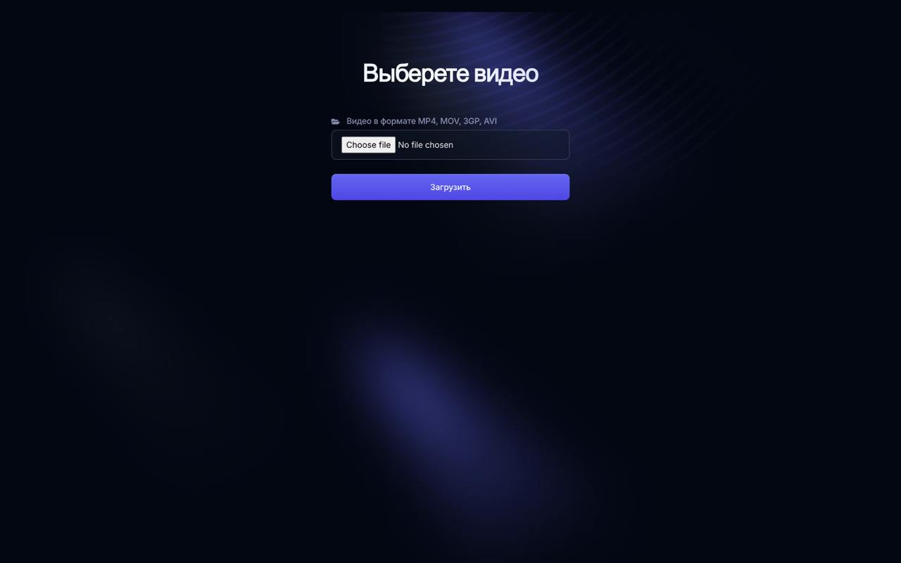

# Создание виральных клипов

## Upload Page Preview

<table>
  <tr>
    <td></td>
    <td></td>
  </tr>
</table>

## Требования
## Установка и запуск

Следуйте этим шагам для запуска всех необходимых сервисов.
### 1. Запуск сервиса API
```bash
cd api
docker compose up --build -d
```
### 2. Запуск модели Qwen2.5 7b VLLM
```bash
cd qwen_vllm
docker compose up --build -d
```
### 3. Запуск сервиса API Whisper
```bash
cd api-whisper
docker compose up --build -d
```
### 4. Запуск frontend 
```bash
cd hacks-viral-frontend
docker compose up -d --build
```
